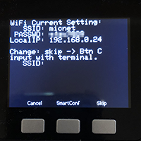
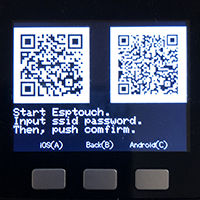
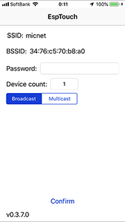
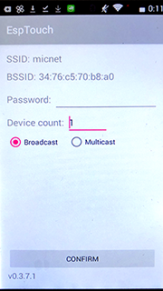

# SetWiFi_Mic

[日本語READMEはこちら](README_jp.md)

SetWiFi_Mic is an M5Stack program for setting up WiFi. Record the SSID and password on M5Stack's NVS (non-volatile storage device). SetWiFi_Mic supports calling of [SD-Updater](https://github.com/tobozo/M5Stack-SD-Updater), so please put SetWiFi_Mic.bin file in microSD and load it using SD-Uploader. You can easily install [SD-Updater](https://github.com/tobozo/M5Stack-SD-Updater) by using [M5Burner_Mic](https://github.com/micutil/M5Burner_Mic).

### Copy the built binnary program to microSD

- Copy the files in the microSD folder to the root of microSD.
- Set the microSD into the M5Stack / Odroid-GO
- Select and launche the program with LovyanLauncher.
- For the original Odroid-GO firmware, no launcher is needed. Switch on with the B button pressed, select the program and launch it. It is necessary to turn the switch on again after startup.

### Programs
- in M5_Gamebin ... 4M minimal SPIFFS partition scheme
- in MD_Gamebin ... 4M default partition scheme
- in MF_Gamebin ... Fire defaut partition scheme
- in OG_Gamebin ... Arduino program for Odroid-GO
- in odroid/firmwares ... fw file for Odroid-GO

## How to enter SSID and Password
### 1, Input with serial monitor or terminal software
When you start SetWiFi_Mic, it will look like the image below.

1. You connect to M5Stack at 115,200 bps with Arduino's serial monitor or common terminal software.
2. You can enter the SSID and password from the software.

If you make a mistake, SetWiFi_Mic has no function such as "Delete" or "Backspace". In such a case, please press the A button and input from the beginning again.

### 2, Use the WiFi SmartConfig App
M5Stack can do WiFi setting by [SmartConfig](https://docs.espressif.com/projects/esp-idf/en/latest/api-reference/network/esp_smartconfig.html). This function is the setting method supported by ESP8266 and ESP32, and can use the same application as the connected WiFi environment of the smartphone using the smartphone application.

1. Press B to enter Smart Config mode.
2. The image below shows the QR code of the download destination of the app for iOS application and for Android. Also, if you press the A button or C button, only one QR code will be displayed, so if it is difficult to read, please display only one and read it with your smartphone.

The smartphone app that you install is an application called Esptouch of the company Espressif of the ESP32 which is a microcomputer of M5Stack. Below is the download URL of iOS and Android of that App. It is easy for you to have the App installed.

Esptouch for iOS 
[https://itunes.apple.com/jp/app/id1071176700](https://itunes.apple.com/jp/app/id1071176700)

Esptouch for Android 
[https://git.io/fjUSl](https://git.io/fjUSl)

   

3. Enter the password of the SSID (the smartphone is connected) in the "Password" field in the Esptouch app.
4. Press the "Confirm" button and wait for a while to complete the settings.

## To call the set SSID and Password
You can call the configured SSID and password with the following code (These are the same as WiFi settings of [LovyanLauncher](https://github.com/lovyan03/M5Stack_LovyanLauncher)).

~~~
#include <Preferences.h>
Preferences preferences;
preferences.begin("wifi-config");
mySSID = preferences.getString("WIFI_SSID");
myPSWD = preferences.getString("WIFI_PASSWD");
preferences.end();
~~~

## History
	ver 1.0.1: 2019/ 5/24 ODROID-GO compatible
	ver 1.0.0: 2019/ 3/27

## License

[CC BY 4.0](https://creativecommons.org/licenses/by/4.0/) Micono (http://github.com/micutil/SetWiFi_Mic).

