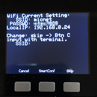

# SetWiFi_Mic

[Click here for English "README"](README.md)

SetWiFi_MicはWiFi設定するためのM5Stackのプログラム。SSIDとパスワードをM5StackのNVS（不揮発記憶装置）に記録します。[SD-Updater](https://github.com/tobozo/M5Stack-SD-Updater)の呼び出しに対応しています。SetWiFi_MicをmicroSDに入れて、SD-Uploaderでロードしてお使いください。[M5Burner_Mic](https://github.com/micutil/M5Burner_Mic)を使うと[SD-Updater](https://github.com/tobozo/M5Stack-SD-Updater)を簡単にインストールでます。

## SSIDとPasswordの入力方法
### 1, ターミナルによる入力
SetWiFi_Micを起動すると以下の画像の様な画面になります。

1. Arduinoのシリアルモニターや、一般的なターミナルソフトで、115200bpsで接続します。
2. そのソフトからSSIDとパスワードを入力します。

なお、入力間違いした場合など、パックスペースなど効きかないので、Aボタンを押して最初から入力し直してください。

### 2, WiFi SmartConfig アプリによる入力
M5Stackは、[SmartConfig](https://docs.espressif.com/projects/esp-idf/en/latest/api-reference/network/esp_smartconfig.html)によるWiFi設定ができます。この機能はESP8266やESP32が対応している設定方法で、スマホのアプリを使ってスマホの接続しているWiFi環境と同じ設定を行えるものです。

1. Bボタンを押すSmartConfigのモードになります。
2. 下の画像はiOSアプリ用とAndroid用のアプリのダウンロード先のQRコードが表示されます。またAボタン、Cボタンを押すと、それぞれ一方のQRコードしか表示されませんので、読み取りにくい場合は片方だけ表示させてスマホで読み取ってください。

インストールしていただくスマホのアプリはM5StackのマイコンであるESP32の会社のEspressifのEsptouchというアプリです。以下のURLからあらかじめインストールしておくと良いかもしれません。

Esptouch for iOS 
[https://itunes.apple.com/jp/app/id1071176700](https://itunes.apple.com/jp/app/id1071176700)

Esptouch for Android 
[https://git.io/fjUSl](https://git.io/fjUSl)

   

3. EsptouchのPasswordの欄にSSIDのパスワードを入力します。
4. Confirmボタンを押してしばらく待つと設定が完了します。

## 設定されたSSIDとパスワードを呼び出すには
設定したSSIDとパスワードは、以下のコードで呼び出すことができます（[LovyanLauncher](https://github.com/lovyan03/M5Stack_LovyanLauncher)のWiFi設定と同じです）。

~~~
#include <Preferences.h>
Preferences preferences;
preferences.begin("wifi-config");
mySSID = preferences.getString("WIFI_SSID");
myPSWD = preferences.getString("WIFI_PASSWD");
preferences.end();
~~~

## 更新履歴
	ver 1.0.1: 2019/ 5/24 ODROID-GO compatible
	ver 1.0.0: 2019/ 3/27

## ライセンス

[CC BY 4.0](https://creativecommons.org/licenses/by/4.0/) Micono (http://github.com/micutil/SetWiFi_Mic).

